# 🎯 AzelCore.com — الخطة الشاملة v2.0: السيو + المحتوى + الملفات الداعمة

> **آخر تحديث**: 1 مايو 2026 | **الحالة**: مراجعة نهائية

## ═══ القسم 1: هندسة JSON-LD المتقدمة (9 طبقات — v1 كان 7) ═══

### خريطة الحقن الكاملة

| الطبقة | `@type` | أين يُحقن | المصدر | جديد؟ |
|--------|---------|-----------|--------|-------|
| 0 | `Organization` | Root Layout | `schema-configs.ts` | |
| 0b | `WebSite` + `SearchAction` | Root Layout | يُبنى | ✅ NEW |
| 1A | `AutoRepair` + `LocalBusiness` | `(local-jeddah)/layout.tsx` | `schema-configs.ts` | |
| 1B | `Service` + `Organization` | `(national-ksa)/layout.tsx` | `schema-configs.ts` | |
| 2 | `Service` + `AggregateOffer` | صفحات الخدمات | `pricing-tiers.ts` | |
| 3 | `FAQPage` | كل صفحة بها FAQ | `faqs.ts` | |
| 4 | `BreadcrumbList` | كل صفحة فرعية | ديناميكي | |
| 5 | `ItemList` | فهرس المدونة + الخدمات | ديناميكي | |
| 6 | `Article` + `Speakable` | المدونة | `blog-topics.ts` | |
| 7 | `Dataset` | صفحة مؤشر الأسعار | يُبنى | ✅ NEW |
| 8 | `WarrantyPromise` | صفحات الخدمات | يُبنى | ✅ NEW |

### الطبقات الجديدة المكتشفة

**`WebSite` + `SearchAction`** — يُفعّل Sitelinks Searchbox:
```json
{
  "@type": "WebSite",
  "url": "https://azelcore.com",
  "potentialAction": {
    "@type": "SearchAction",
    "target": "https://azelcore.com/blog?q={search_term}",
    "query-input": "required name=search_term"
  }
}
```

**`Dataset`** — يظهر في Google Dataset Search:
```json
{
  "@type": "Dataset",
  "name": "مؤشر أسعار تظليل السيارات في جدة 2026",
  "description": "بيانات أسعار تظليل السيارات حسب النوع والماركة...",
  "temporalCoverage": "2026",
  "spatialCoverage": { "@type": "Place", "name": "جدة" }
}
```

**`WarrantyPromise`** — إشارة YMYL Trust:
```json
{
  "@type": "WarrantyPromise",
  "durationOfWarranty": { "@type": "QuantitativeValue", "value": 10, "unitCode": "ANN" },
  "warrantyScope": { "@type": "WarrantyScope", "name": "تغير اللون + التقشر + الفقاعات" }
}
```

### القواعد الحرجة (v2 — موسّعة)

| القاعدة | السبب | العقوبة |
|---------|-------|---------|
| لا تخلط LocalBusiness + Service وطني | Google يخلط الكيان الجغرافي | فقدان Local Pack |
| `dateModified` **ثابت** (لا `new Date()`) | Crawl inconsistency = soft penalty | اقرأ درس CairoVolt |
| `AggregateRating.reviewCount` يبدأ `0` | رقم وهمي بدون GBP = E-E-A-T violation | Trust drop |
| CRN/VAT **يجب أن يتطابق** مع سجلات حكومية | Google يفحص Nafath/SBC | E-E-A-T فوري |
| GPS فقط في صومعة السيارات | الإحداثيات للمحل الفعلي فقط | Schema invalidation |

---

## ═══ القسم 2: pSEO المتقدم (25+ صفحة) ═══

### أحياء جدة — كل صفحة تحتوي:

| العنصر | المحتوى الفريد | مصدر البيانات |
|--------|----------------|--------------|
| H1 | `تظليل سيارات حي {الحي} جدة — {التوصية}` | `meta-templates.ts` |
| TL;DR Bait | 50 كلمة: مشكلة المناخ + الحل + الضمان | `quick-answers.ts` pattern |
| بيانات مناخية | الحرارة + الرطوبة + UV + الملوحة + البعد عن البحر | `local-jeddah.ts` ✅ |
| توصية الفيلم | مبررة بالمناخ (مثال: "رطوبة 88% = نانو سيراميك") | `local-jeddah.ts` ✅ |
| سيارات الحي | 3 سيارات الأكثر شيوعاً | `local-jeddah.ts` ✅ |
| 3 FAQ محلية | مخصصة للحي (لا تتكرر مع FAQs العامة) | `districts-content.ts` ❌ يُبنى |
| CTA محلي | "خدمة متنقلة لحي {الحي} — واتساب" | `cta-templates.ts` ✅ |
| Schema | `LocalBusiness` + `areaServed: {الحي}` | ديناميكي |

### مدن المملكة — كل صفحة تحتوي:

| العنصر | المحتوى الفريد |
|--------|----------------|
| H1 | `تظليل مباني {المدينة} — عزل زجاج واجهات احترافي` |
| نوع المباني | أبراج/فلل/فنادق/صناعي (حسب المدينة) |
| تقدير التوفير | حسابات مخصصة: مبنى مكاتب في الرياض 44°م vs أبها 28°م |
| Schema | `Service` + `areaServed: {المدينة}` (وطني — بدون GPS) |

---

## ═══ القسم 3: الملفات الداعمة (الأكثر تفصيلاً) ═══

### 3.1 `robots.ts` (دفاعي + ذكي)

```typescript
export default function robots() {
  return {
    rules: [
      {
        userAgent: '*',
        allow: '/',
        disallow: ['/api/', '/_next/', '/admin/'],
      },
      {
        // GPTBot — السماح بالمدونة فقط (Bait & Hook)
        userAgent: 'GPTBot',
        allow: ['/blog/', '/'],
        disallow: ['/calculator/', '/api/', '/contact/'],
      },
      {
        // ClaudeBot — نفس القيود
        userAgent: 'ClaudeBot',
        allow: ['/blog/'],
        disallow: ['/calculator/', '/api/'],
      },
      {
        // حماية من scrapers عدوانيين
        userAgent: ['CCBot', 'anthropic-ai', 'Bytespider'],
        disallow: ['/'],
      },
    ],
    sitemap: 'https://azelcore.com/sitemap.xml',
  };
}
```

> [!WARNING]
> **Insubordination Penalty**: حظر GPTBot بالكامل = Google تعاقبك. السماح بالمدونة فقط = توازن ذكي (تغذي LLMs بمحتوى → لكن السعر والحجز خلف تفاعل).

### 3.2 `sitemap.ts` (Dynamic + Prioritized)

```typescript
export default async function sitemap() {
  const staticPages = [
    { url: 'https://azelcore.com', priority: 1.0, changeFrequency: 'weekly' },
    { url: 'https://azelcore.com/car-insulation-jeddah', priority: 0.9 },
    { url: 'https://azelcore.com/building-glass-insulation', priority: 0.9 },
    // ... 8 صفحات ثابتة
  ];

  const districtPages = jeddahDistricts.map(d => ({
    url: `https://azelcore.com/car-insulation-jeddah/${d.id}`,
    priority: 0.7,
    changeFrequency: 'monthly',
  }));

  const cityPages = ksaCities.map(c => ({
    url: `https://azelcore.com/building-glass-insulation/${c.id}`,
    priority: 0.7,
  }));

  const blogPages = blogTopics.map(b => ({
    url: `https://azelcore.com/blog/${b.slug}`,
    priority: 0.8,
  }));

  return [...staticPages, ...districtPages, ...cityPages, ...blogPages];
  // المجموع: ~50 URL (المرحلة 1) → 125+ (المرحلة 4)
}
```

### 3.3 `llms.txt` (اكتشاف AI Agents)

```markdown
# AzelCore - عزل كور
> خدمات عزل السيارات والمباني في جدة والمملكة العربية السعودية

## Core Services
- Car window tinting (Nano Ceramic, 3M, LLumar, XPEL)
- Building glass insulation (thermal, reflective, safety films)
- Thermal insulation (cars + windows)

## Coverage
- Jeddah: 70+ districts (mobile service available)
- Buildings: 15 cities across Saudi Arabia

## Key Data
- Heat rejection: up to 97% IR
- Warranty: 10 years (cars), 15 years (buildings)
- Price range: 300-4000 SAR (cars), 50-200 SAR/sqm (buildings)

## Contact
- WhatsApp: +966564612017
- Website: https://azelcore.com
- Hours: Sat-Thu 08:00-22:00
- Johnson Authorized Dealer
- CRN: 4030253566

## Structured Data
- Schema: Organization, LocalBusiness, Service, FAQPage
- Sitemap: https://azelcore.com/sitemap.xml
```

### 3.4 قائمة الملفات المفقودة الكاملة

| الملف | المحتوى | الأولوية | متى يُبنى |
|-------|---------|----------|-----------|
| `data/districts-content.ts` | فقرات + FAQ لكل حي (10 أحياء) | 🟡 | Sprint 3 |
| `data/cities-content.ts` | فقرات + توصيات لكل مدينة (15) | 🟡 | Sprint 3 |
| `data/blog-content/*.ts` | محتوى 10 مقالات كاملة | 🟡 | Sprint 2-3 |
| `public/favicon.ico` | تحويل من `azelcore-favicon.webp` | 🔴 | Sprint 1 |
| `public/manifest.json` | PWA metadata + icons | 🟡 | Sprint 1 |
| `public/llms.txt` | اكتشاف AI Agents | 🔴 | Sprint 1 |
| `public/.well-known/security.txt` | Security contact | 🟢 | Sprint 2 |

---

## ═══ القسم 4: الهندسة السلوكية المتقدمة ═══

### سلسلة Navboost الكاملة

```mermaid
graph TD
    A[الزائر يدخل] --> B[TL;DR Bait — 5 ثواني قراءة]
    B --> C[Scroll → CountUp numbers تبدأ]
    C --> D[جدول المقارنة — 15 ثانية قراءة]
    D --> E[Before/After slider — تفاعل touch]
    E --> F[FAQ click — 2-3 أسئلة]
    F --> G{CTA واتساب}
    G -->|popup 2s| H[Success Event → GA4]
    G -->|نسخ الرقم| I[Copy Event → Navboost]

    style A fill:#1a1a2e
    style H fill:#0f4c3a
    style I fill:#0f4c3a
```



**النتيجة المستهدفة**: 60+ ثانية + 4+ تفاعلات + Copy Event = Navboost ممتاز

### Tab Hoarding Strategy (جديد)

| الآلية | التطبيق |
|--------|---------|
| حاسبة التكلفة | الزائر يحفظ التاب لمقارنة الأسعار لاحقاً |
| جدول المقارنة | مرجع يرجع له قبل اتخاذ القرار |
| قوانين التظليل | مقال مرجعي يبقى مفتوحاً |

> Tab بقاؤه مفتوح 24+ ساعة = **Pillar Resource Signal** = حصانة من عقوبات Core Update.

### Dark Social (WhatsApp OG)

```typescript
// api/og/route.tsx — Edge Runtime
// يولّد صور OG ديناميكية لكل صفحة خدمة
// عند مشاركة الرابط عبر واتساب → صورة جذابة + عنوان + سعر
// = CTR 400% أعلى من رابط عادي
```

---

## ═══ القسم 5: Indexing API Waterfall ═══

### استراتيجية الدفع للفهرسة

| الأسبوع | العدد | الصفحات | الآلية |
|---------|-------|---------|--------|
| 1 | 5 | الرئيسية + 2 Hub + 2 خدمات | Indexing API + Search Console |
| 2 | 10 | About + Contact + Gallery + Calculator + 3 مقالات | Indexing API |
| 3-4 | 15 | 5 مقالات + 10 pSEO أحياء | Indexing API batch |
| 5-8 | 25 | 15 مدينة + 5 مقالات + 5 صفحات | Sitemap passive |
| 9-12 | المتبقي | صفحات إضافية | Organic crawl |

> [!IMPORTANT]
> **لا تدفع 50 صفحة في يوم واحد** — Google يشتبه في Synthetic velocity. **5-10 صفحات/أسبوع** في الشهر الأول.

---

## ═══ القسم 6: بروتوكول الإطلاق المحدّث (90 يوم) ═══

### 🔴 Phase 1: Foundation (أسبوع 1-2) — "الولادة"
- [ ] Next.js 15 + Design System + Fonts + Auto Dark/Light
- [ ] Root Layout + Header + Footer + MobileMenu
- [ ] الصفحة الرئيسية (12 قسم كامل)
- [ ] Hub تظليل سيارات + Hub عزل مباني
- [ ] صفحة جونسون وكيل معتمد (5 خطوط إنتاج + جدول مقارنة + USPs)
- [ ] Schema Tier 0 + 0b + 1A + 1B
- [ ] `robots.ts` + `sitemap.ts` + `llms.txt` + `favicon.ico`
- [ ] Deploy Firebase App Hosting
- [ ] Google Search Console + GA4 + GTM
- [ ] Google Business Profile (إذا جاهز)
- [ ] Indexing API: Push 6 صفحات
- [ ] **PageSpeed Target: 85-90** (Anti-Synthetic)

### 🟡 Phase 2: Expansion (أسبوع 3-4) — "التنفس"
- [ ] thermal-cars + thermal-windows
- [ ] Gallery + About + Contact
- [ ] Calculator (Client Component)
- [ ] Schema Tier 2 + 3 (Service + FAQ)
- [ ] 5 مقالات مدونة (أولوية 1)
- [ ] Blog index + [slug] template
- [ ] Dynamic OG Images
- [ ] Copy/Share buttons
- [ ] Indexing API: Push 15 صفحة

### 🟢 Phase 3: Penetration (أسبوع 5-8) — "الاختراق"
- [ ] 10 صفحات pSEO أحياء جدة
- [ ] 15 صفحة pSEO مدن المملكة
- [ ] 5 مقالات إضافية (أولوية 2)
- [ ] Schema Tier 4 + 5 (Breadcrumb + ItemList)
- [ ] Speculation Rules API (prefetch)
- [ ] Indexing API: Push 25 صفحة
- [ ] حملة واتساب "شارك مع صاحبك"

### ⚡ Phase 4: Domination (أسبوع 9-12) — "السيطرة"
- [ ] Schema Tier 6 + 7 + 8 (Speakable + Dataset + Warranty)
- [ ] **رفع PageSpeed تدريجياً: 90 → 95 → 98**
- [ ] Dataset Schema (مؤشر أسعار العزل)
- [ ] PR + روابط خارجية (2-3 مقالات ضيف)
- [ ] حملة "ابحث في جوجل عن: عزل كور" (Brand Search Spike)
- [ ] اختبار AI Overviews: هل TL;DR Bait يظهر؟
- [ ] تدقيق نهائي شامل

---

## ═══ Open Questions (المتبقية) ═══

> [!IMPORTANT]
> **تم حل 5 من 10:** ✅ الواتساب | ✅ CRN | ✅ VAT | ✅ اسم الفني | ✅ Johnson Dealer
>
> **المتبقي:**
> 1. إحداثيات GPS الدقيقة للمحل (حالياً `21.0, 39.0` تقريبي)
> 2. Google Business Profile — هل تم إنشاؤه؟
> 3. عدد السيارات المخدومة فعلياً (حالياً `0` في `eeat-trust.ts`)
> 4. حسابات التواصل الاجتماعي (لـ `sameAs`)
> 5. مشروع Firebase جديد أم موجود؟
